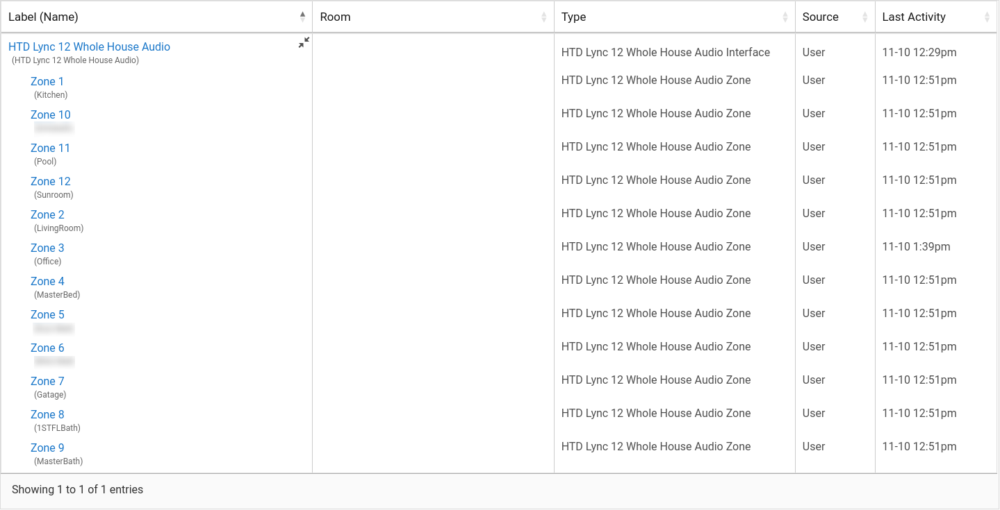
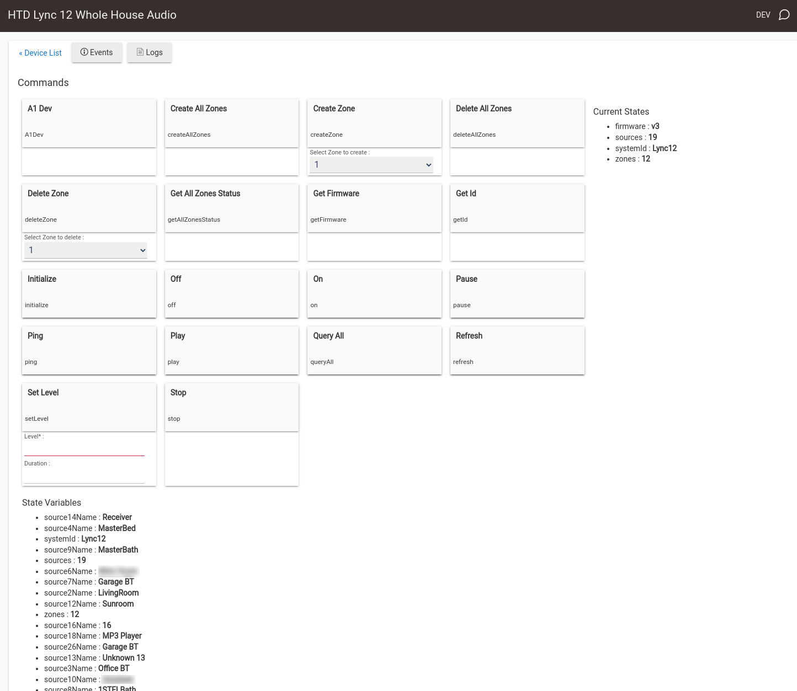
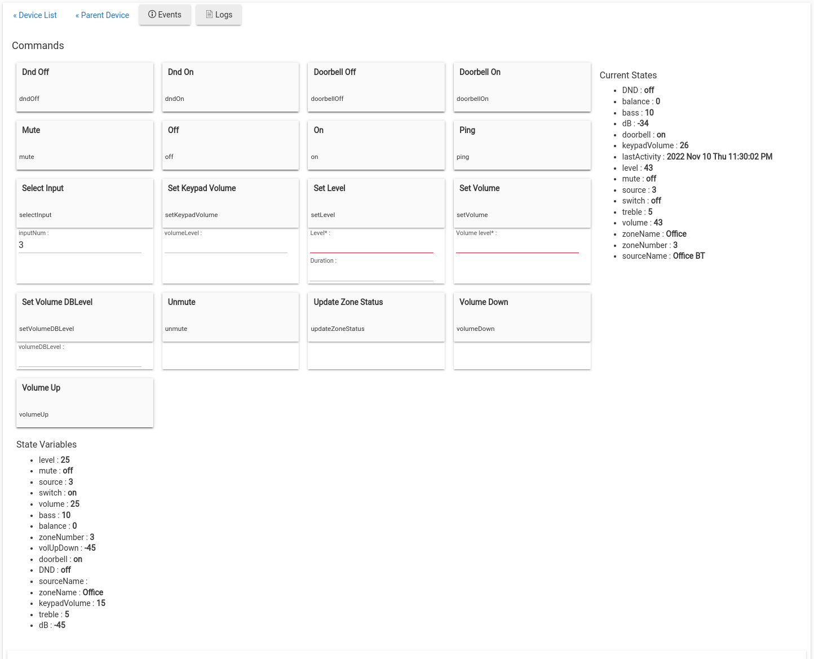
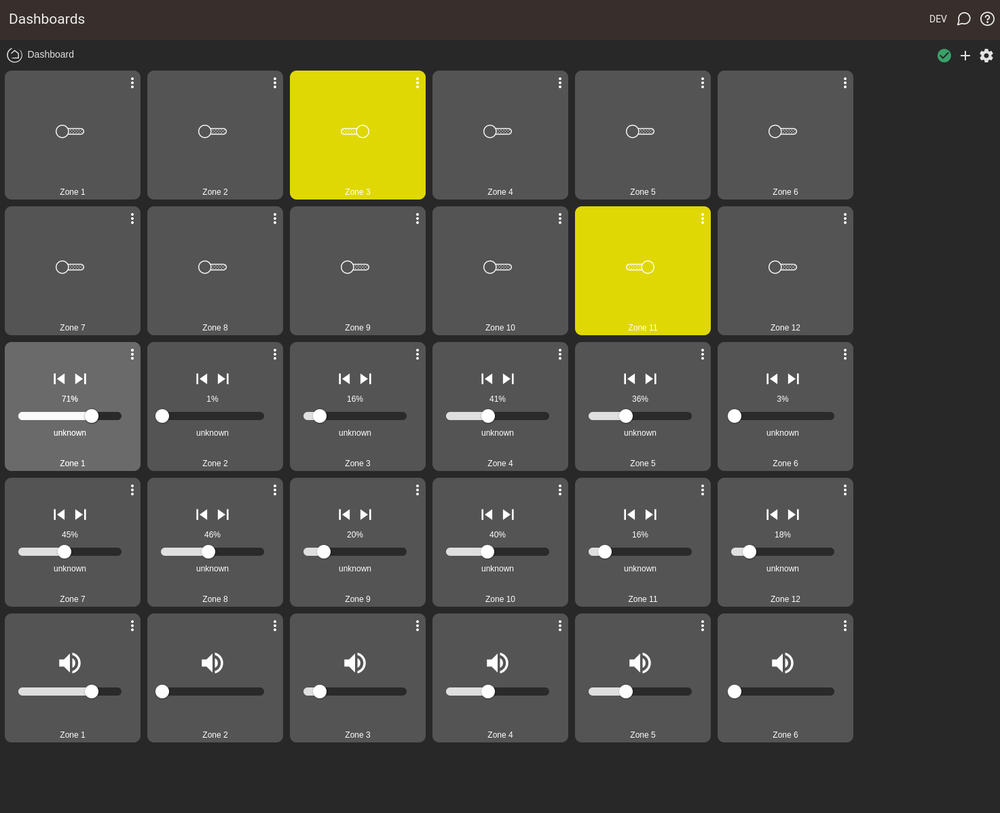

# HTD Lync 12/6 Whole House Audio Hubitat Device Driver
## Overview
This is Hubitat driver for HTD Lync 12 and 6 Whole House Audio. This driver was tested only with Lync 12 
with official GW-SL1 "Smart Gateway"
This driver may also work with aftermarket RS232-Over-TCP/IP
such as Global Cache IP2SL-P/WF2SL iTach devices.
I originally wrote a simple all On/Of driver, so I can create an automation to turn off all the zones overnight 
to save power, and then I got carriageway with adding other functionalities to it (I hope everyone else can enjoy it).

## Installation
1. For each .groovy file, navigate to Drivers Code, click on +New Driver and Copy/Paste the content and click save.
2. Create a new virtual device, by selecting HTD Lync 12 Whole House Audio Interface from the type dropdown,
give it some random Device Name (it will be renamed to "HTD Lync 12 Whole House Audio" automatically)

3. Enter Lync 12 or 6 GW IP address and save preferences. After you save the preferences, following will happen 
automatically:
   - Search for systemId (Lync12 or 6)
   - Search for firmware version (tested with v3 but should work with v2 as well)
   - Determine  number of zones (12 or 6)
   - Determine number of sources (18 for Lync 12 v2, 19 for Lync 12 v3 or 12 for Lync 6)
   - Pull zone names and Sources names from the Lync
   - All zones will be created named using the names pulled from Lync controller
   - Update all the states for all the zones.
4. And now, you should be able to control your HTD Lync 18 or Lync 6 via Hubitat Hub, and create awsome automations.

# Roadmap 
1. Add mp3 player functionality
2. Add ability to change Source/Zone names.
Open for other ideas and suggestions

# Other info
Please don't judge me, this is my firs groovy project. I'm open to criticism and suggestions.

Currently tested with Lync 12 v3 with GW-SL1 "Smart Gateway"

